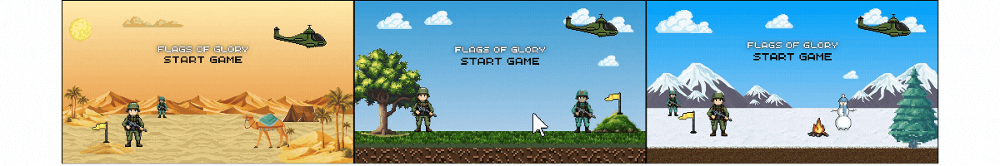

<h1 align="center">
  
  
</h1>
<p  align="center">
  
    
    
    </a>
</p>

## 🎮 Présentation
**Flags of Glory** est un jeu multijoueur stratégique où le but est de récupérer le 🏳️ drapeau ennemi dans un temps limité de **3 minutes**. Vous contrôlez différentes unités aux capacités variées, et vous devrez élaborer une stratégie pour :
- ⚔️ Attaquer vos ennemis,
- 🛡️ Défendre votre territoire,
- ❤️ Soigner vos troupes.


## 🧑‍🎖️ Caractéristiques des personnages
### **💂 Soldat**
- **Vie** : ❤️❤️❤️❤️❤️❤️ (6)
- **Vitesse** : 🏃‍♂️🏃‍♂️ (2)
- **Pouvoir** : Attaque infligeant **1 point de dégâts** aux ennemis situés dans les **8 cases autour**.

### **🩺 Docteur**
- **Vie** : ❤️ (1)
- **Vitesse** : 🏃‍♂️🏃‍♂️🏃‍♂️ (3)
- **Pouvoir** : Guérit **2 points de vie** pour les alliés situés dans les **8 cases autour**.

### **🚁 Hélico**
- **Vie** : ❤️❤️ (2)
- **Vitesse** : 🏃‍♂️🏃‍♂️🏃‍♂️🏃‍♂️ (4)
- **Pouvoir** : Attaque infligeant **3 points de dégâts** aux ennemis situés dans **3 cases en dessous**.

### **🚜 Char**
- **Vie** : ❤️❤️❤️❤️❤️❤️ (6)
- **Vitesse** : 🏃‍♂️ (1)
- **Pouvoir** : Attaque infligeant **3 points de dégâts** aux ennemis situés dans **2 cases autour**.


## 🗺️ Types de cases

- 🧱 **Murs, arbre, sapin, dune** : Bloquent les balles et ne peuvent pas être traversés.
- 🌳 **Buisson** : Rend le joueur **invisible** et **invincible**, peut être traversé.
- 🐪 **Chameau**, ⛄ **Bonhomme de neige** : Bloque les balles, peut être traversé, et **augmente la vitesse**.
- 🌊🔥 **Oasis, feu, puits** : Soignent les unités.


## 🕹️ Comment jouer ?

1. Le jeu se joue à **2 joueurs**. 👥
2. Chaque joueur choisit une équipe parmi les options : **défensive** 🛡️, **offensive** ⚔️, ou **neutre** ⚖️.
3. Les joueurs jouent à tour de rôle :
   - 🖱️ **Sélectionnez** un personnage avec la souris.
   - ⌨️ **Déplacez-le** avec le clavier.
   - À la fin de chaque déplacement, si un ennemi est à proximité, utilisez un **pouvoir d’attaque**.


## 🚀 Installation

Pour installer le jeu et les extension, il suffit de suivre ces etapes :

1. Cloner le projet sur votre machine
```bash
git clone https://github.com/DanialSultani/Projet-Python-.git
cd Projet-Python-
```

2. Créer un environnement conda

> Si vous n'avez pas conda, vous pouvez le télécharger [ici](https://docs.conda.io/projects/conda/en/latest/user-guide/install/index.html)

```bash
conda config --add channels conda-forge
conda env create -f environment.yml
```

3. Activer l'environnement conda

```bash
conda activate clash_of_frontlines_env
```


## 🎮 Lancer le jeu

Pour lancer le jeu, il suffit de lancer le fichier `main.py` avec python

```bash
    python main.py
```


<p style="margin-top: 50px;">🎉 Amusez-vous bien et que le meilleur stratège gagne ! 🏆</p>

